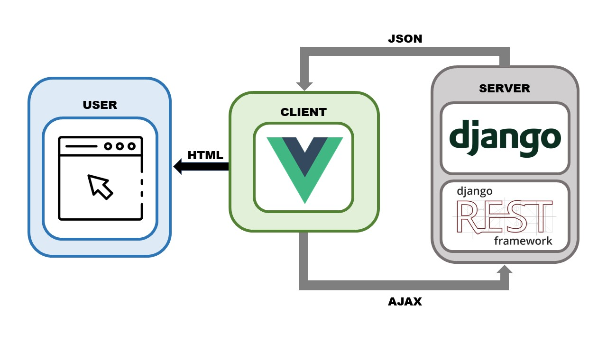
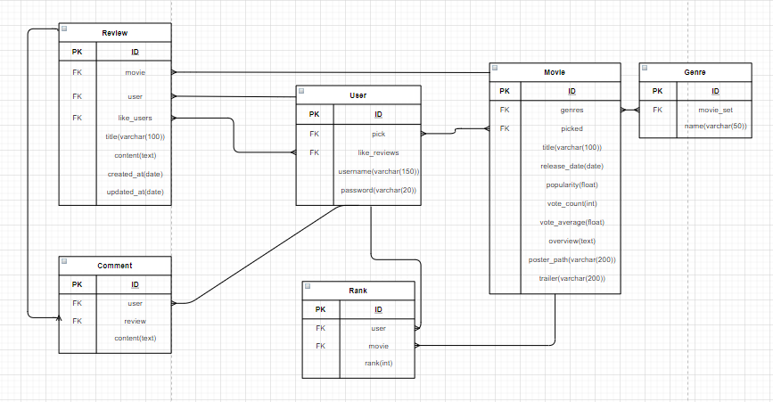
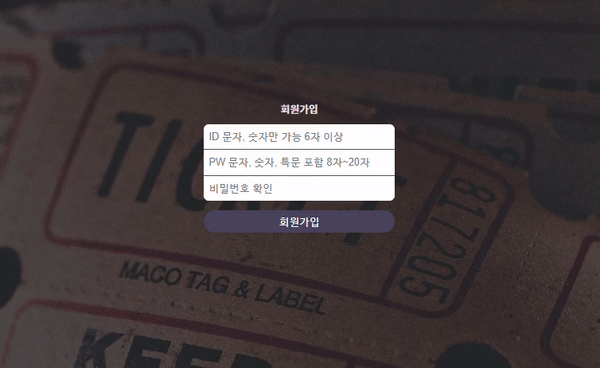
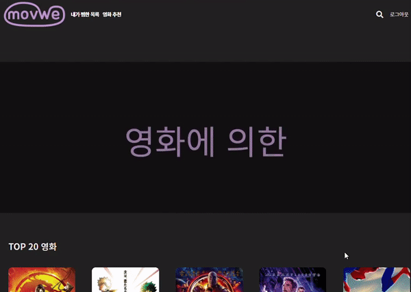
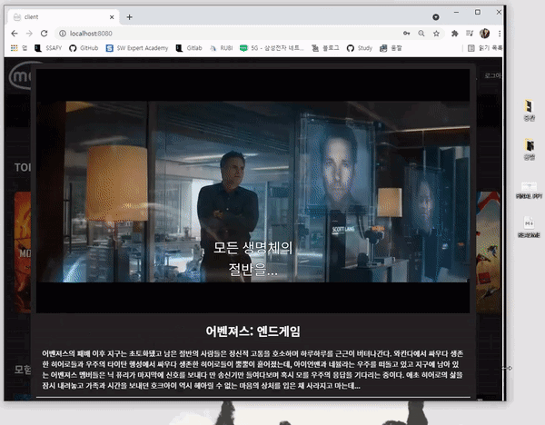
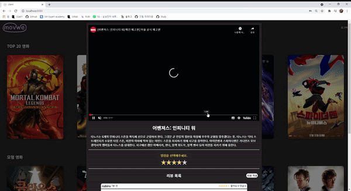

# 👨‍💻 Final pjt

> 2021.05.20 ~ 2021.05.27

<br>

## 📜 프로젝트 개요

<br>

### 프로젝트 목표 🏆

- 영화 리뷰 커뮤니티 사이트를 개발합니다. 
  - 영화에 대한 평점을 매길 수 있습니다.
  - 영화에 대한 리뷰를 남길 수 있습니다.
    - 리뷰는 생성, 수정, 삭제가 가능합니다.
  - 리뷰에 대한 댓글을 남길 수 있습니다.
    - 댓글은 생성, 삭제가 가능합니다.

<br>

### 프로젝트 구조 🔍



- **server**
  - `django`와 `django rest framework`를 이용한 API Server
  - **유저, 영화, 영화에 대한 유저의 평점, 리뷰, 리뷰에 대한 댓글** 모델을 만들어 관리합니다. 
- **client**
  - `Vue.js`를 이용하여 사용자에게 웹 페이지를 렌더링합니다.
  - 사용자에게 정보를 제공하기 위해서 Server와의 비동기 통신(`fetch, async/await`)을 진행합니다.

<br>

### 프로젝트 기술 스택 🔨


<br>

---

<br>

## 📃 프로젝트 실행 방법

> server
>
> client

- `	python3` 
- `Node.js` 

### server 💾

1. 가상 환경 생성

   ```bash
   ...{PROJECT_DIR}/server
   $ python -m venv {가상환경 이름}
   ```

2. 가상 환경 실행

   ```bash
   $ source venv/Scripts/activate
   ```

3. 패키지 다운로드

   ```bash
   $ pip install -r requirements.txt
   ```

4. migration 적용 (DB 적용)

   ```bash
   $ python manage.py migrate
   ```

5. seed 데이터 로드

   ```bash
   $ python manage.py loaddata movie.json
   ```

6. server 실행

   ```bash
   $ python manage.py runserver
   ```

<br>

### client 💻

1. 패키지 다운로드

   ```bash
   ..{PROJECT_DIR}/client
   $ npm install
   ```

2. client 실행

   ```bash
   $ npm run serve
   ```

<br>

---

<br>

## 📌 팀원 정보 및 업무 분담 내역

팀장: **김지용**

* `Vue.js`를 이용한 Client 디자인 및 설계, 서비스 모델 구성

팀원: **성루비**

* `django rest framework`를 이용한 API 서버 설계 및 seed 데이터 생성

<br>

---

<br>

## 🔗 데이터베이스 모델링(ERD)

> User
>
> Movie
>
> Rank
>
> Review
>
> Comment



<br>

---

<br>

## ✌ 핵심 기능

* 화면 사이즈에 따른 **영화 카드 배치 최적화**
* **페이저 기능**을 포함한 영화 카드 슬라이더
* **마우스 오버를 통한 영화 상세 진입**
* 사용자 **평점을 기반한 영화 추천** 서비스
* 영화와 장르 **검색** 기능

<br>


## 😎 목표 서비스 구현 및 실제 구현 정도

<br>

### 인증

* `회원가입`, `로그인`이 가능합니다.
* **아이디, 비밀번호, 비밀번호 확인**이 특정 조건을 만족해야 회원가입이 가능합니다.
  - 아이디와 비밀번호는 **정규 표현식**을 이용하여 client, server 두 곳에서 모두 검증합니다.
  - 비밀번호 확인은 현재 입력한 비밀번호와 동일해야 하며, client, server 두 곳에서 모두 검증합니다.

- 로그인에 성공하면 server에서 **token**을 전달합니다. 이를 client가 저장하여 사용합니다.

- 결과 (회원가입)



<br>

### 메인 페이지

- `CSS animation`과 `HTML canvas`태그를 이용하여 메인 페이지 최상단의 애니메이션을 출력합니다.

- 결과 (메인 페이지 애니메이션)

  

<br>

- Server에서 모든 영화를 응답 받아 **인기순**, **장르별**로 나눈 영화 카드를 슬라이더 형태로 출력합니다.

  - 슬라이더에 마우스를 오버하면 이전 혹은 다음 슬라이더로 넘어갈 수 있습니다.
  - 각 슬라이더의 **페이지 개수**와 **현재 페이지**를 슬라이더 하단에 원으로 표현 하였습니다.
  - 각 슬라이더의 최대 카드 개수는 20개 입니다.
  - **반응형**으로 구현되어 브라우저 너비가 조정되면 페이지의 개수와 출력되는 카드 개수가 변경됩니다.

- 각 장르 **전체보기** 버튼을 눌러 현재 슬라이더에 존재하는 카드 이외의 영화 정보를 확인할 수 있습니다.

- 결과 (메인 페이지 슬라이더)

  

- 결과 (메인 페이지 resize)

  

- 결과 (장르 전체 보기)

  

<br>

### 영화 상세 정보와 리뷰, 댓글 CRUD

- 영화 카드에 마우스를 **hover**하면 영화 타이틀 평점을 확인할 수 있습니다.
- **찜하기와 영화 상세 보기(modal) 버튼**이 존재합니다.
- **상세 보기 버튼 (i 버튼)**을 클릭하면 modal이 생성되며 해당 영화의 상세 정보를 확인할 수 있습니다.
  - 영화 평점을 매길 수 있습니다.
  - **리뷰 작성 버튼을 누르면 리뷰 폼이 내려오고**, 해당 폼을 통해 리뷰를 작성할 수 있습니다.
  - 리뷰는 5개만 출력되며 리뷰를 더 보기 위해서 **리뷰 전체 보기 페이지**로 이동해야 합니다.
- 리뷰 게시물은 **얼마 전에 작성되었는지가 표시**됩니다.
- **리뷰를 클릭하면 리뷰 상세 페이지**로 이동합니다.
- 리뷰 상세 페이지 우측 상단 **좋아요(하트)**버튼을 눌러 좋아요를 등록하거나 취소할 수 있습니다.
- **리뷰를 작성한 user만 수정, 삭제 버튼이 보입니다.**

- 결과 (리뷰 상세 modal과 리뷰 생성, 수정, 삭제)

  

- 결과 (modal resize)

  

<br>

- **댓글을 생성**할 수 있으며 **해당 댓글을 작성한 user만 해당 댓글을 삭제할 수 있는 버튼이 생성됩니다.**

- 결과 (댓글 생성 및 삭제)

  

<br>

### 검색

- 페이지 상단의 돋보기 버튼에 마우스를 **hover**하면 검색을 위한 창이 나옵니다.

- 검색 단어가 바뀌면 해당 단어로 검색되는 영화와 장르 개수가 출력됩니다.

  - 비동기 처리가 여러번 발생하는 것을 막기 위해서 `AbortController`를 사용합니다.

- **enter**버튼을 눌러 검색 결과를 확인할 수 있습니다.

- 결과 (검색)

  

<br>

### 내가 찜한 영화, 추천 영화

- 페이지 상단에 내가 찜한 목록을 눌러 내가 찜한 영화 목록을 확인할 수 있습니다.

  - 찜한 영화가 없다면 다시 home화면으로 redirect 됩니다.

- 결과 (내가 찜한 영화 목록)

  

<br>

- **최소 한 개 이상의 영화에 평점**을 매겼다면 영화 추천 서비스를 이용할 수 있습니다.

- 영화 추천은 **유저가 작성한 평점을 기반으로 각 장르에 점수를 적절히 합산해 유저가 평점을 매기지 않은 영화를 추천합니다.**

- 결과 (영화 추천)

  

